# Smart Vinyl Player

**Sai Porumamilla** · User Interface I, Project 1

[**Try the live app**](https://sai-porumamilla.github.io/UI-Project_1/) · [Source code on GitHub](https://github.com/sai-porumamilla/UI-Project_1) · [Demo video](#demo-video)

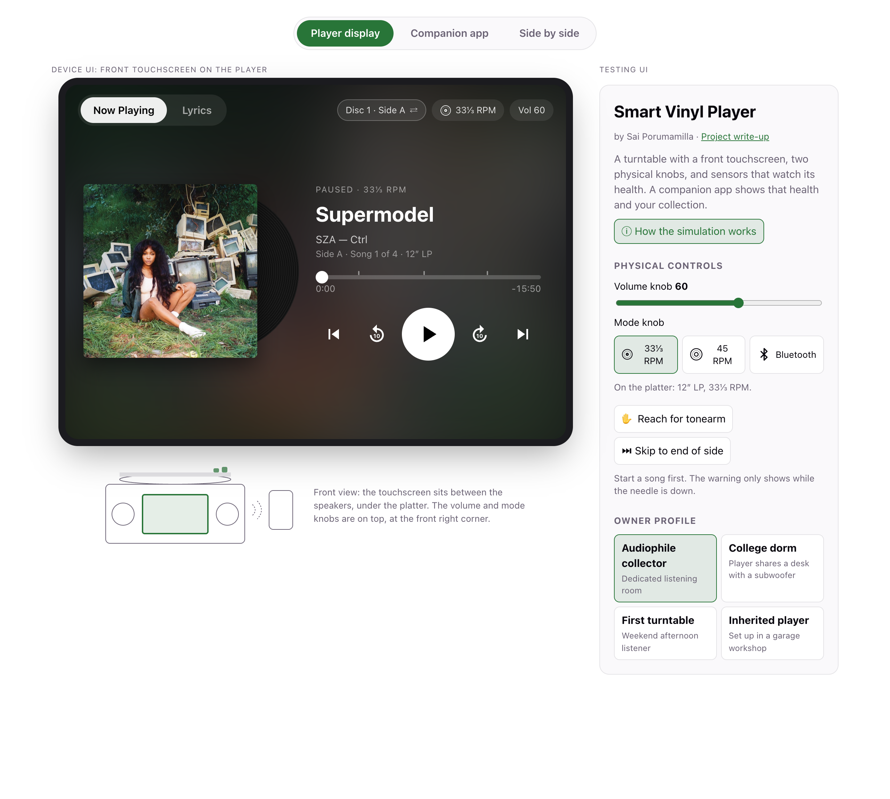

## The project

A record player that keeps everything people love about vinyl, the physical record, the platter and the needle, while adding a digital display and sensors. A touchscreen faces forward on the front of the player, below the turntable and between the left and right speakers. Two physical knobs sit on top at the front right corner: one for volume and one for the playback mode (33⅓ RPM, 45 RPM or Bluetooth).

Sensors inside the player watch its own health: belt and platter speed, stylus cleanliness, air quality, vibration, audio clipping and tonearm level. They also recognize which song is playing and the size of the disc on the platter. A companion phone app shows that health, turns the detected plays into a library and listening stats, and works as a remote for the player.

The mock-up has two interfaces, chosen from one master page:

1. **Player display**: the touchscreen on the front of the player.
2. **Companion app**: the phone app paired with the player.

Both interfaces are fixed at a **1.41 : 1** ratio, the ISO A-series paper ratio (√2). The display is landscape and the phone is portrait.

---

## Design

### Affordances and physical properties

**Physical properties.** The Smart Vinyl Player is an all-in-one record player: a turntable on top, a speaker on each side and a touchscreen on the front panel between them, below the platter.

- **Large, heavy and fixed in place.** It isn't portable or pocketable. It sits on a shelf, console or side table, and once placed it stays there. A record player needs a level, steady surface, since vibration and tilt hurt playback (two of the health sensors watch exactly this).
- **Used standing up, from above and from across the room.** You load and flip records looking down at the platter, but you mostly listen from elsewhere in the room. That's why the screen faces forward rather than up, and why the idle screen shows large artwork and text that read at a distance.
- **Spread over more than one surface.** The platter, tonearm, lid and knobs are on the top. The screen and speakers are on the front and sides. The phone app adds a third place to control it from, away from the player.
- **Handled with care.** Records are fragile and expensive, and the needle is delicate. Most of the interaction design is about keeping hands away from the parts that can be damaged.

**Affordances of each part, and how the design responds:**

| Part | What it affords (invites people to do) | Problem | Design response |
| --- | --- | --- | --- |
| Tonearm and needle | Grabbing and lifting. It's a small arm with a finger lift, so it practically asks to be picked up | Every participant pauses, stops or skips by lifting the needle by hand, which can scratch the record | **Signifier:** a "Needle is on the record" strip while playing. **Feedback:** a warning with a big Pause button if a hand comes near. **Automatic tonearm:** pause, skip and scrub on the screen move the arm for you |
| Platter and spindle | Placing a record, centered by the spindle | Nothing tells you what's playing, how far into the side you are, or which speed a disc needs | **Sensing:** the player detects the record, side and disc size and shows them on the screen |
| The record | Flipping over; double albums have a second disc to swap in | It's easy to lose track of which side or disc comes next | **Feedback and guidance:** at the end of a side the screen and phone say whether to flip or swap discs, and which side is next |
| Lid (dust cover) | Opening and closing | You have to open it to see where the needle is (P3) | The screen shows the side, the song number and a scrub bar spanning the side, so the lid can stay closed. Closing it also keeps out dust (air quality sensor) |
| Volume knob | Turning; clockwise means louder (natural **mapping**) | No feedback except sound, and one participant's volume control faces the wall | **Feedback:** an arched meter on the screen. It's an endless encoder with an LED ring, so the phone can change the volume too without the knob pointing at the wrong value |
| Mode knob (33⅓ / 45 / Bluetooth) | Turning between three detent positions | Nothing stops you switching to the wrong speed mid-record (P3) | **Constraint:** the knob locks while the needle is down. **Signifiers:** a lock on the speed chip, the disc size on screen, and an amber "Set speed to 33⅓ RPM" chip if it doesn't match the disc |
| Front touchscreen | Tapping and swiping, like a phone | It has to be readable from across the room, not just up close | Big touch targets, Now Playing and Lyrics pages, and an idle mode that fades to large artwork |
| Speakers | Listening from anywhere in the room | You may not be standing at the player when you want to change something | The companion app works as a remote: playback, scrubbing, volume and side changes |

**Design of Everyday Things principles at work:**

- **Signifiers** tell people what to do where the physical object can't: the hands-off strip, the lock icon, the amber speed chip and the "Up next" side.
- **Constraints** stop the most damaging mistakes: the speed knob locks while playing, and the needle won't drop at the wrong speed.
- **Feedback** answers every physical action on the screen: the volume meter, the mode name and symbol, "✓ Detected" after a record change, and "Set from the companion app" for remote changes.
- **Mapping** keeps the physical controls conventional: clockwise for louder, and the speed knob in the traditional bottom-right spot.
- **Conceptual model:** the screen mirrors what's physically happening, a record with sides and a tonearm that moves to a groove, instead of pretending it's a streaming app. That's why scrubbing shows the arm moving and why playback stops at the end of each side.

### Assumptions about the smart features

These are the sensing features the interface assumes. They should be feasible, but how they would be built is out of scope.

| Sensor | What it detects | How the UI uses it |
| --- | --- | --- |
| Platter speed sensor | Whether the platter is turning and how far it is from 33⅓ or 45 RPM | Belt & platter speed card in the app |
| Stylus sensor | Debris build-up, tracked as hours played since the last cleaning | Stylus cleanliness card and stylus lifetime bar |
| Air quality sensor (PM2.5) on the side of the player | Whether the room is dusty | Air quality card, with a tip to keep the lid closed |
| Vibration sensor | Vibration reaching the platter, for example from nearby speakers | Vibration card |
| Audio clipping detector | Distortion from the stylus mistracking | Stylus clipping card |
| Tonearm level sensor | Whether the arm is parallel to the record | Tonearm level card |
| Tonearm proximity sensor | A hand reaching for the arm while the needle is down | Hands-off warning on the display |
| Song recognition | Which song and record are playing | Now Playing info and the app's listening history |
| Knob encoders | Volume and mode knob positions. The volume knob is an endless encoder with an LED ring, so the phone can change the volume too | Volume meter and mode overlays on the display |
| Disc size sensor on the platter | Whether the record is a 12″ LP or a 7″ single, which tells the speed it needs (33⅓ or 45 RPM) | The disc size on Now Playing, and the wrong-speed warning |
| Speed knob lock | A latch that stops the mode knob from turning while the needle is on the record | The lock signifier and the "Speed locked" message |

### User needs and design requirements

These come from the three interviews below (P1–P3 = participants 1–3). The **Built** column shows whether the mock-up already meets each requirement.

| User need | Heard from | Design requirement | Built |
| --- | --- | --- | --- |
| Pause, stop or skip without lifting the needle by hand and risking a scratch | P1, P2, P3 | The display offers play/pause and previous/next, and warns the user away from the tonearm while the needle is down | Yes |
| Find a specific song without placing the needle by hand | P2, P3 | Next/previous, scrubbing and tapping a lyric all cue the automatic tonearm, which shows the arm moving to the matching groove | Yes |
| Know how far into the side the record is without opening the lid | P1, P2, P3 | The display shows "Side A · Song 2 of 4" and a scrub bar spanning the side, with marks between songs | Yes |
| See what's playing from across the room | P1, P2, P3 | A front-facing screen that, when left alone, fades to large album art with the song, artist and album | Yes |
| Follow along with lyrics, as on Spotify or Apple Music | P1, P2, P3 | The display shows time-synced lyrics, and tapping a line skips to it | Yes, line by line. Word-by-word timing is future work |
| Know when to flip the record or change discs | P3 | When a side ends, the display says whether to flip or swap discs, lists every side with its songs and length, and offers other albums | Yes |
| Get feedback when turning a knob; today they can only tell by ear, and one participant's volume switch faces the wall | P1, P2, P3 | The display shows the new volume on an arched meter, or the new mode's name and symbol | Yes |
| Avoid playing a record at the wrong speed | P3 | The speed knob locks while a record plays. The player senses the disc's size, and won't drop the needle if the knob doesn't match | Yes |
| Notice problems before they're visible or audible; today they look for a crooked needle or a platter that won't spin, then search Reddit or Google | P1, P2, P3 | Sensors feed one overall health rating plus a card per sensor, with a specific fix for anything Fair or Poor | Yes |
| Be alerted where they'll see it; P1 wants it on the player, P2 and P3 on their phone | P1, P2, P3 | Send alerts to both. Side-end prompts already appear on both; health alerts are only in the app so far | Partly |
| Show off the collection and the records they're proud of | P2, P3 | A collection view with vinyl colors, a record count and a filter for special editions | Yes |
| See the next song while one is playing | P2 | The app's Now Playing sheet shows what's up next, or that the side is about to end | Yes |
| See Wrapped-style listening stats for records | P1, P2, P3 | Listening hours, songs spun, a day-by-hour heatmap and top artists, built from automatically detected plays | Yes |
| See most-played records by month, and skipped songs | P1, P3 | Monthly top-records view and skip tracking | Not yet |
| Share stats and play time with friends | P2 | Share a stats card from the app | Not yet |

### Interviews

I interviewed three people outside the class, for about 15–20 minutes each. The questions covered five themes: how they listen to music, how they use a record player, controls and feedback, care and maintenance, and their collection and listening stats. At the end I described my design concepts and asked for reactions, so the concepts couldn't bias their earlier answers. All participants are anonymized. [Full interview notes](https://github.com/sai-porumamilla/UI-Project_1/blob/main/interview.md).

| Participant | Experience with record players |
| --- | --- |
| **P1** | Has never owned one. Drawn to the look and to collecting favorite artists, put off by the cost. Uses Spotify and plays orchestral music |
| **P2** | Has used one once, at their brother's. Listens with headphones or in the car on Apple Music |
| **P3** | Owner with a 78-album collection and a Sony automatic turntable connected to a soundbar |

**What I learned, and how it shaped the design:**

- **Everyone stops or skips by lifting the needle by hand.** P1 worries about scratches because records are expensive. P2 found it hard to place the needle on a specific song. P3 drags the needle past songs when desperate. This confirmed the core idea: play/pause and skip on the screen, the hands-off tonearm warning, and an automatic tonearm that moves to the right groove when you scrub, skip or tap a lyric.
- **Nobody can easily tell where they are on a side.** P1 relies on knowing the song order, P2 reads it from the groove, and P3 has to open the lid. This led to "Side A · Song 2 of 4" and a scrub bar that spans the side, with marks between songs.
- **Knobs give no feedback except sound.** All three tell whether volume or speed changed by listening, and P3's volume switch faces the wall. This supports the on-screen volume meter and mode overlay. P3 also pointed out that nothing stops you from playing a 33⅓ record at 45. That led to the speed lock and disc-size detection described under *Physical knobs*.
- **They expect the screen on the front.** P1 said on the rim, facing forward into the room; P2 said the bottom half, angled outward; and P3 said toward the front. This matches the front-facing display between the speakers.
- **Everyone already uses synced lyrics.** P2 described Apple Music's word-for-word sync, and the one change P3 would make to record players is being able to skip by tapping the lyrics. Both are in the design: tapping a line seeks to it, and word-level timing is future work.
- **Problems are noticed late.** Participants only notice trouble from visible signs (a crooked needle, a platter that doesn't spin) or skipping, then search Reddit or Google. The health screen's per-sensor fixes answer this directly.
- **They disagree on where alerts belong.** P1 doesn't want another app; P2 and P3 prefer their phone because the player's screen is small. The design sends side-end prompts to both, and extending this to health alerts is next.
- **Stats matter to everyone.** All three enjoy Wrapped-style stats and want them for records: minutes, top artists and albums, totals (P2, P3), most-played record each month and skipped songs (P1), and sharing with friends (P2). The Insights tab covers the basics; the rest is in future work.
- **Reactions to the concepts were positive.** P3 called them "pretty good," P1 asked for a small decibel readout, and P2 wanted to share stats with friends.

### Sketches

#### 10-plus-10: play, pause, stop or skip safely

One design challenge, taken through both rounds of 10-plus-10 on a single page. The problem came from the interviews: everyone stops or skips by lifting the needle by hand, which risks scratching the record.

The **top half** has ten different ideas:

1. Touch play/pause on a screen (starred)
2. A physical button
3. The tonearm lifts when you lift the lid
4. The tonearm lifts when the cover is touched
5. A sensor that warns when a hand is near the arm
6. Pause in a phone app
7. A voice command ("pause")
8. A ring around the platter that turns red
9. The tonearm locks in place while playing
10. A gesture to skip

The **bottom half** has ten variations on the starred idea, the touchscreen, exploring:

- **Layout:** transport-only controls, album art with song, artist and side, and a full Now Playing screen with a progress bar.
- **The hands-off warning:** on its own, and with a Pause button.
- **A playing strip:** a "Needle is on arm, do not touch, pause" strip under the art.
- **Bigger controls:** larger transport buttons.
- **The phone:** a mini player bar, a full portrait Now Playing view, and the same hands-off warning.

The final design combines several of them: the touchscreen controls, the warning from idea 5, and the strip and warning-with-Pause variations. Together they became the hands-off strip, the tonearm warning and the automatic tonearm.

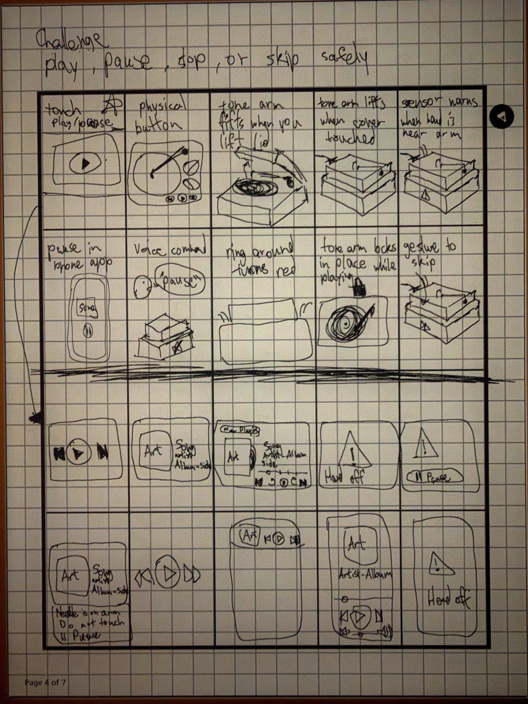

#### 10-plus-10: feedback when a physical knob turns

The problem: all three participants could only tell that the volume or speed changed by listening, and one participant's volume control faces the wall.

The **top half** has ten ideas:

1. An arched gauge showing "75 volume" (starred)
2. A top-down view with a border light that reacts to the volume
3. A ring around the platter showing the volume
4. A volume bar on the Now Playing card
5. A volume slider on the phone
6. A warning banner across the top of Now Playing
7. A "wrong speed" warning
8. A "record playing, cannot change" warning
9. A "size detected" check mark
10. The platter showing "33 RPM" with a check mark

The **bottom half** has ten variations on the arched gauge:

- **Gauge shape:** a dial with a 0–100 scale instead of an arc.
- **Speaker icon:** sound waves that grow with the volume.
- **Volume bar:** one that appears, or drops down, over Now Playing.
- **Timing:** how long the gauge stays on screen.
- **Knob feedback:** haptic and vibration feedback in the knob itself, and a red or green glow around the knob.

The arched gauge became the volume meter, which appears whenever either knob or the phone changes the volume. The second row of ideas, the wrong-speed warning, "record playing, cannot change" and "size detected", became the speed lock and disc-size detection after P3's interview comment.

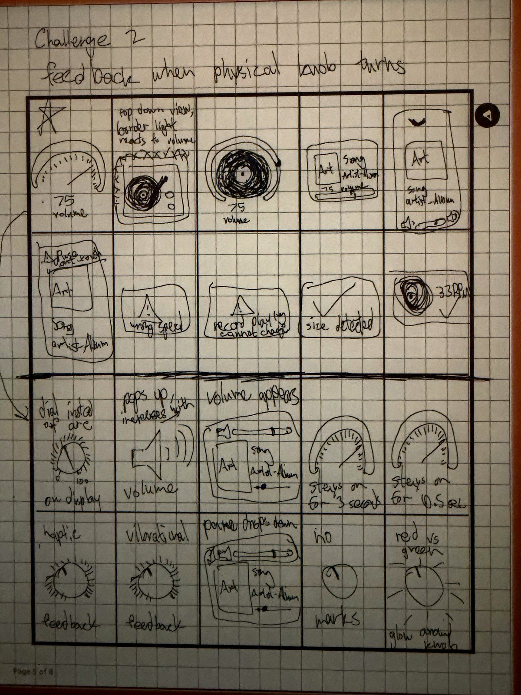

#### 10-plus-10: tell the user to flip the record or swap discs

The problem: one participant flips sides and handles multi-disc albums, and nobody could easily tell where they were on a side.

The **top half** has ten ideas:

1. "Side A is over" with buttons for the other sides (starred)
2. "Side A is over" with the sides grouped by disc
3. A light on the player at the end of a side
4. A warning on the display: "2 min left"
5. An animation of the record turning over
6. A list of sides to choose from
7. "Swap in Disc 2" for double albums
8. "Up next" showing the next song (*Go Gina*)
9. A chime from the speakers
10. Suggesting a different album afterwards ("Play *Gemini Rights*?")

The **bottom half** has ten layouts for the side picker:

- **Single list:** circles, pills, a stack with a short description per side, or a diagonal strip.
- **Grids:** 2 × 2, a "Next?" grid, and hexagons.
- **A flow:** A → B → C → D.
- **Grouped by disc:** "Side A is over" with A/B and C/D grouped and a "Not now" button.
- **"Continue?":** with "Next" and "Not now".

The final picker combines the disc-grouped layout with "Not now", the starred "Side A is over" heading, "Swap in Disc 2", the flip animation, "Up next" and suggesting a new album. It now appears on both the player and the phone.

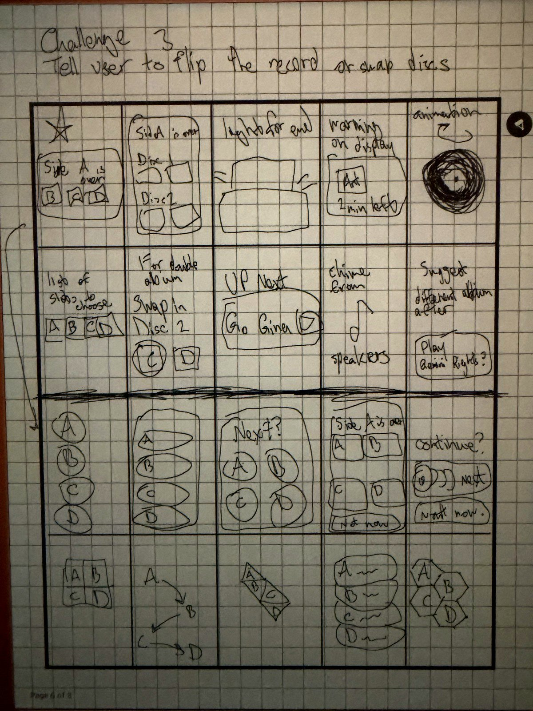

#### Vanilla sketch

The first page sketches the player and its front display:

- **The player:** a turntable with the tonearm, two knobs, an on/off light and a callout for alerts.
- **Display screens:** what song is playing with its album art (*Broken Clocks*, SZA), time-synced lyrics, and play/pause playback controls.
- **Volume:** an arched gauge that appears when the volume knob turns.
- **Secondary device:** a box marking the phone that pairs with the player.

The second page sketches the mobile interface. I showed both pages to the three interview participants (see *Feedback on the vanilla sketch*):

- **Health screen:** the platter speed (33 RPM) and pass/fail checks for the needle and air quality.
- **Library screen:** a grid of records that opens into a record's artwork.
- **Notes:** "play/pause on device" and "prevent user from stopping mid-play".

| Player and display | Mobile interface |
| --- | --- |
| 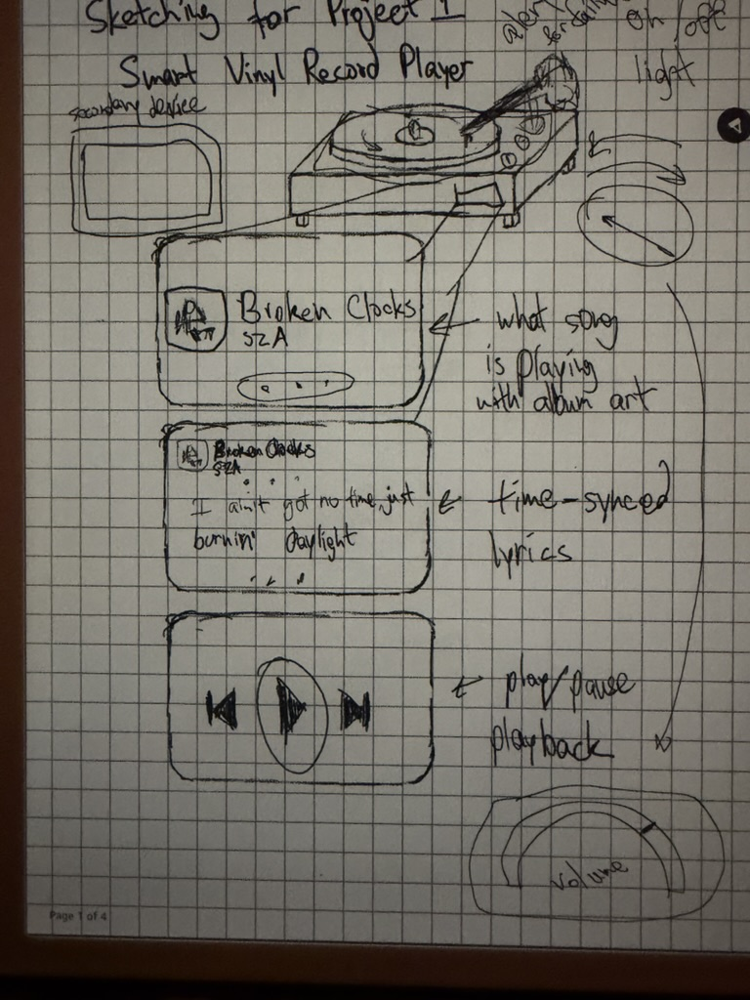 | 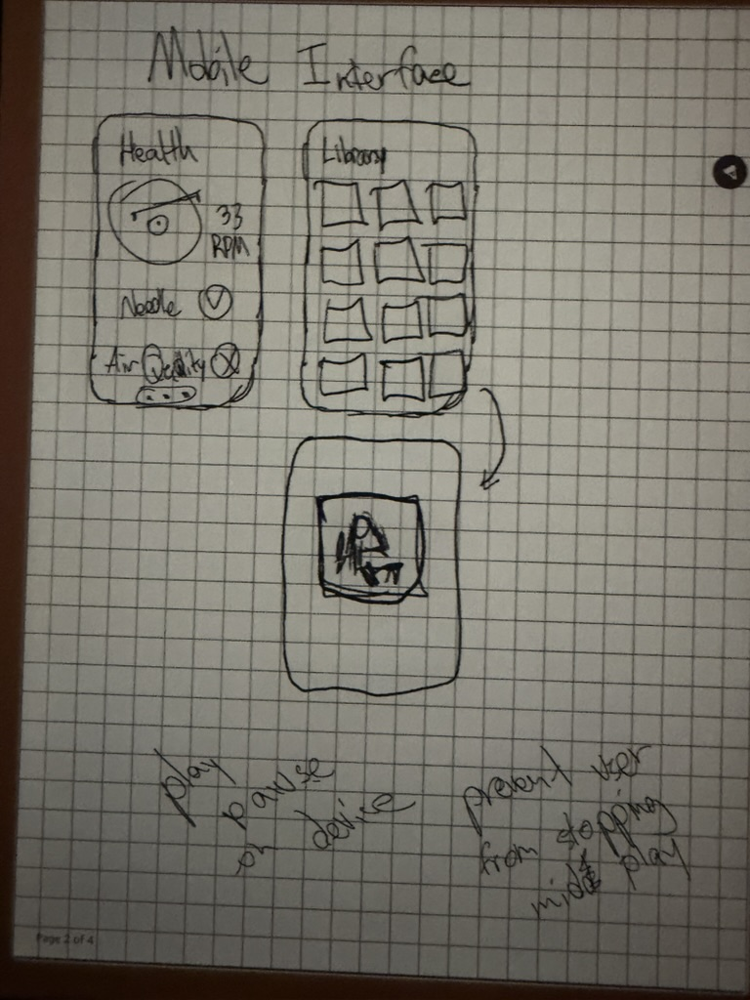 |

#### Storyboard

One evening with the Smart Vinyl Player, in six panels:

1. **They put on a record.** The player recognizes it and sets up Side A.
2. **From a distance,** they can see what's playing at a glance.
3. **Out of habit,** they reach to lift the needle. The player warns them first.
4. **They tap Pause,** and the automatic arm lifts the needle with no risk of a scratch.
5. **Later, Side A ends.** Their phone tells them to flip the record.
6. **They flip it,** the player detects Side B, and the music keeps going.

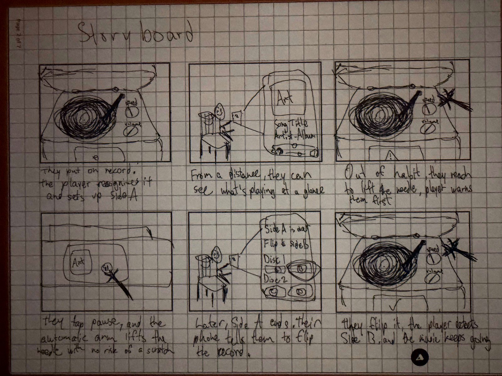

#### Hybrid sketch

The hybrid sketch places the design on a real record player. The interface is drawn onto a photo of an all-in-one turntable with a front display:

- **Touchscreen:** on the front, facing the room, with the speakers sketched in on each side.
- **Knobs:** the volume knob and the 33⅓ / 45 / Bluetooth speed knob at the front right of the top. The speed knob locks while a record plays.
- **Tonearm:** the hands-off warning when a hand gets near it mid-song.
- **Lid:** it can stay closed, because the screen shows where the needle is.
- **Phone:** the companion app, paired over Bluetooth.

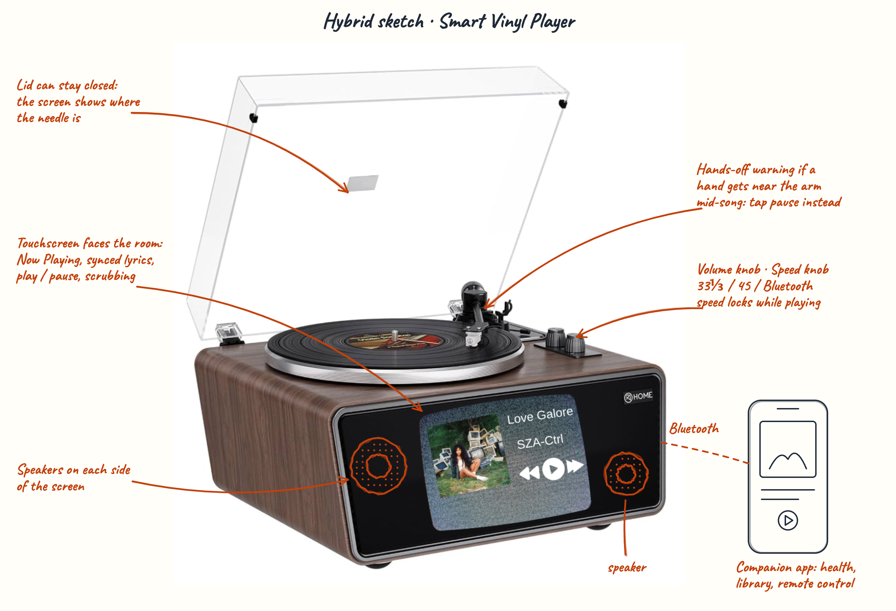

*Base photo: a retail product photo of a record player with a front display.*

**From sketch to build.** Most of the sketch survived into the final design, with a few changes:

- **Display pages:** the separate playback-controls screen merged into Now Playing, which leaves two display pages, Now Playing and Lyrics.
- **Volume gauge:** kept almost exactly as drawn.
- **"Prevent user from stopping mid-play":** became the hands-off tonearm warning and the automatic tonearm.
- **Health screen:** grew from a few pass/fail checks into six sensors with four tiers.
- **Library:** gained listening insights alongside the collection.
- **The phone:** became a full remote: playback, scrubbing, volume and side changes.

### Feedback on the vanilla sketch

At the end of each interview, I showed the three participants my vanilla sketch (above) and asked what they thought, when they'd use it and what worried them. I saved this for the end so it couldn't bias their earlier answers. The sketch covered these concepts:

- A front touchscreen with playback controls and synced lyrics
- A warning not to touch the tonearm while a song is playing
- Physical knobs whose changes show up on the screen
- A phone app with a health score for the player
- A phone app that showcases your collection and listening stats

| Participant | Feedback | What I changed |
| --- | --- | --- |
| **P1** | Would like a small decibel readout below the main display. The one thing they'd change about record players: an auto-scanning feature that shows a record's inner artwork | Both are in *Future work* (a live level meter, and inner-sleeve artwork) |
| **P2** | Would like to share stats and play time with friends, which was also the one thing they'd change about record players | Sharing is in *Future work* as a shareable stats card. Their wish to see the next song while one plays became "Up next" on the phone's Now Playing sheet |
| **P3** | "Pretty good." The one thing they'd change: skip by tapping the lyrics. Something I hadn't asked about: the player lets you change speed even when a record is meant for 33 RPM, and there should be a signifier to prevent that | Tapping a lyric line already skipped to it, which confirmed that feature. The speed comment led to a new feature, the **speed lock**: the knob locks while the needle is down, the player senses the disc's size, and an amber chip and an explanation stop the needle from dropping at the wrong speed |

Overall the reactions were positive, and nobody raised concerns about the concepts themselves. The feedback mostly asked for more: two requests went into *Future work*, one confirmed an existing feature, and P3's speed comment changed the design.

---

## The interface

### Master page

A switch at the top chooses **Player display**, **Companion app** or **Side by side**. Below the device sits a front-view drawing of the player that highlights where the current interface lives. The **Testing UI** panel holds the project info, an info button that explains the simulation, and controls that stand in for physical actions.

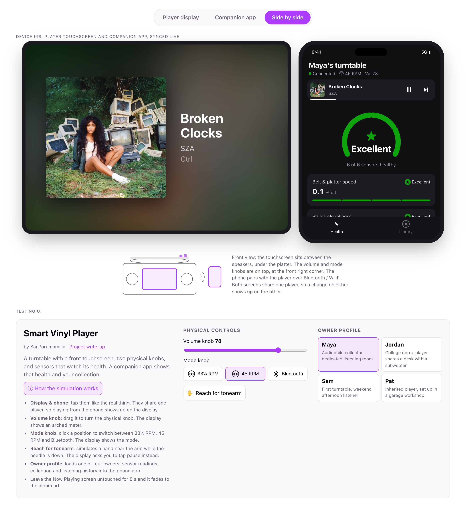

#### Testing UI controls

| Control | What it simulates |
| --- | --- |
| Volume knob slider | Turning the physical volume knob |
| Mode knob (33⅓ RPM / 45 RPM / Bluetooth) | Turning the physical mode knob |
| Reach for tonearm | A hand near the tonearm while a song plays |
| Skip to end of side | Jumps to the last few seconds of the side, to demo the flip / swap-disc prompt without waiting |
| Owner profile (Audiophile collector, College dorm, First turntable, Inherited player) | Loads a different owner's sensor readings, collection and listening history into the app |

### Player display

**Now Playing.** Play/pause, previous/next, ±10-second skips and a scrub bar, with the song, artist, album and where you are on the record (for example "Side A · Song 1 of 4 · 12″ LP"). A record peeks out behind the album art and spins at the selected speed, so 45 RPM visibly spins faster than 33⅓.

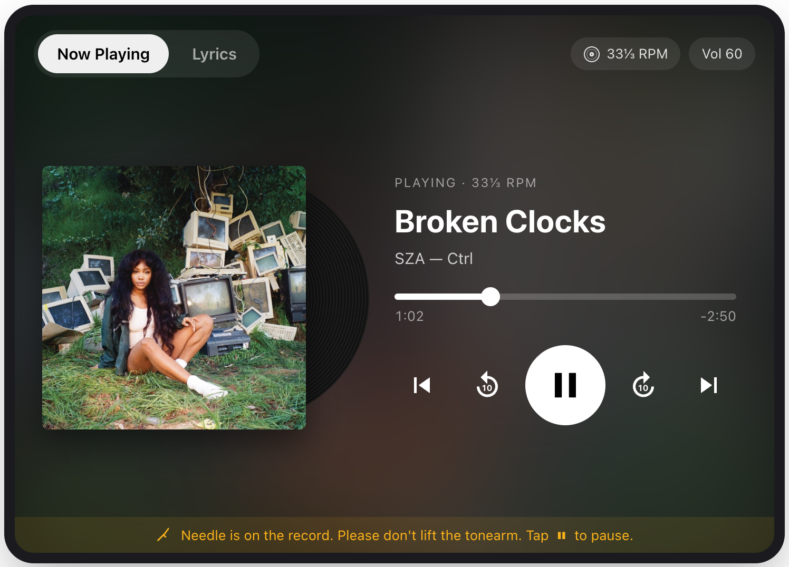

**Scrubbing moves the needle.** On a turntable, a point in a song is a physical place on the record, so seeking works the way a real automatic tonearm would. Dragging the scrub bar, tapping ±10 seconds or tapping a lyric lifts the needle, swings the arm to the groove for that moment and lowers it again, then playback resumes. While this happens, a top-down view of the platter replaces the album art. The arm's shadow moves away from it as it lifts, a ring in the album's color marks the groove where it will land, and the target time is shown. Pausing mid-move leaves the arm up. In Bluetooth mode there's no needle, so seeking is instant.

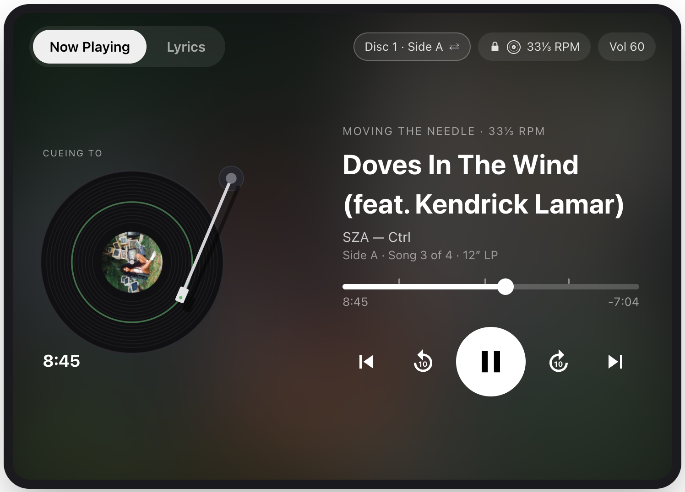

**Sides, flipping and swapping records.** The display treats a record the way it physically is: as sides. The scrub bar spans only the side that's face up, with small marks at the gaps between songs, and a chip in the header shows the current disc and side (for example "Disc 1 · Side A"). When the needle reaches the end of a side, it returns to rest and the display tells you what to do next:

- **Flip the record:** the next side is on the same disc, like Side A to Side B.
- **Swap in Disc 2:** the next side is on the other disc of a double album, like Side B to Side C.
- **Start again or put on a new album:** after the last side.

Every side of the record and every other album is offered, with the suggested next step highlighted. Choosing one shows the physical step (the disc flipping over, or one disc going back in its sleeve and the next coming in), then "✓ Detected" with the new side and artwork, and then the needle drops and playback starts. The phone shows the same choices at the same time (see *End of a side, on the phone*). Tapping the side chip opens the same choices at any point. In Bluetooth mode, music streams straight through from one side to the next.

The sample records are SZA's *Ctrl* (two discs, Sides A–D) and Steve Lacy's *The Lo-Fis* (one disc, Sides A–B).

| Side over | Flipping the record | New album detected |
| --- | --- | --- |
| 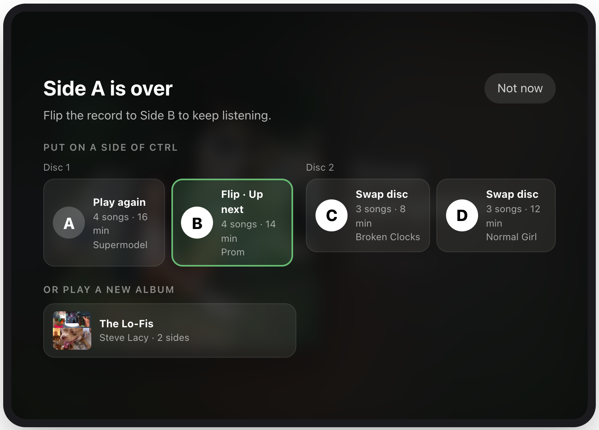 | 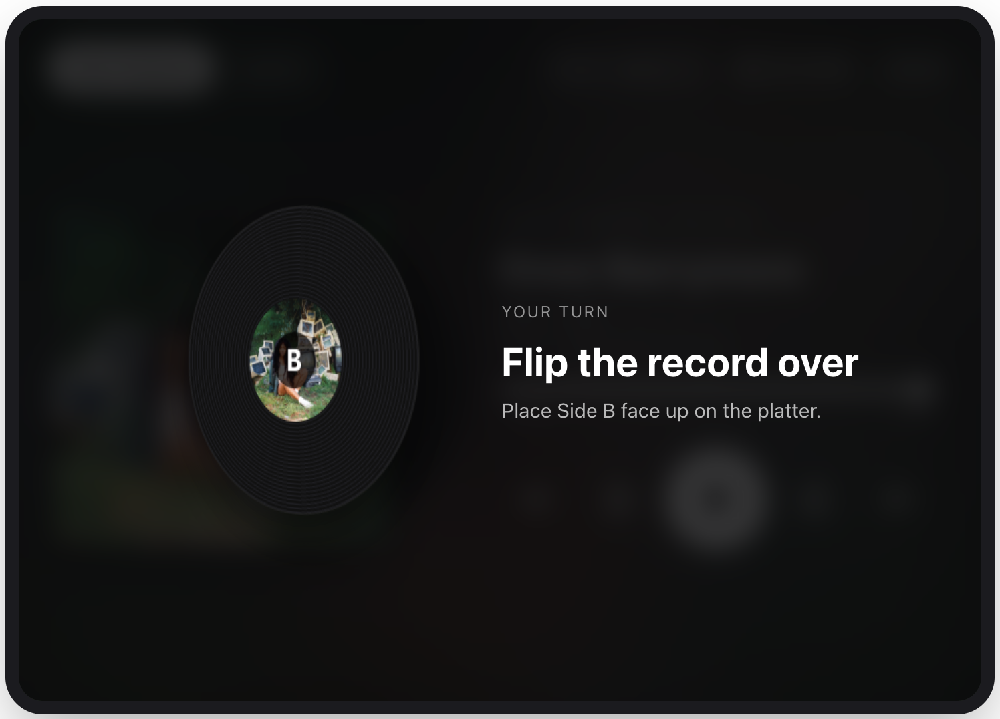 | 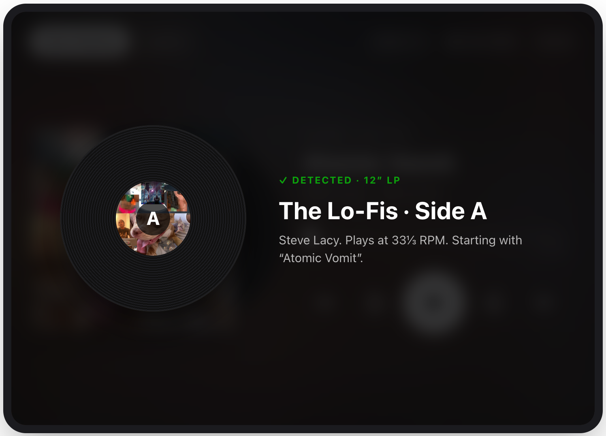 |

**Idle mode.** If nobody touches the Now Playing screen for 8 seconds, it fades to large album art with the song, artist and album names, readable from across the room. One tap brings the controls back.

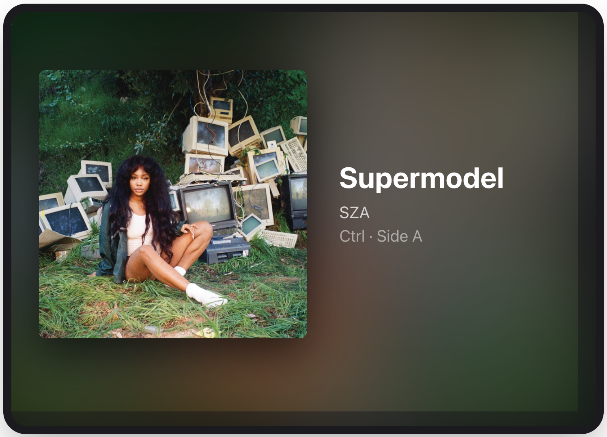

**Synced lyrics.** The line being sung is highlighted and kept centered, Apple Music / Spotify style. Tapping a line jumps the song to it. Lyrics come from [LRCLIB](https://lrclib.net), a free synced-lyrics database.

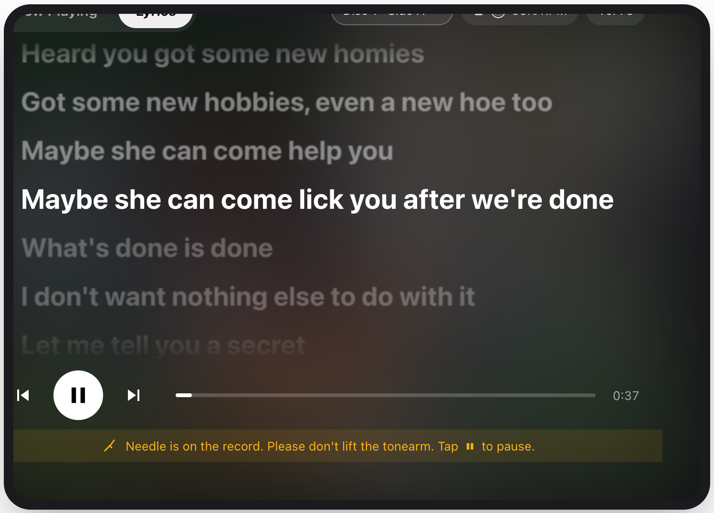

**Hands off the tonearm.** Lifting the needle mid-song can scratch the record, so the display steers people to a safer action:

- **Signifier:** while the needle is down, a strip along the bottom says not to lift the arm and to tap pause instead.
- **Feedback:** if the proximity sensor detects a hand near the arm, a full-screen warning appears with a large, pulsing pause button. Pausing dismisses it.

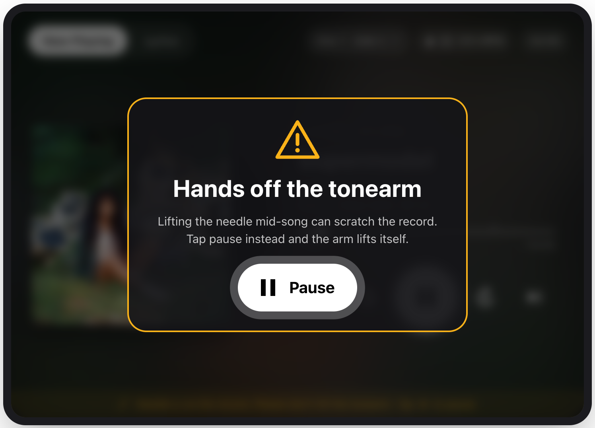

**Physical knobs.** The display reacts whenever either knob turns:

- **Volume knob:** an arched panel meter with the new value. The arc turns orange above 85.
- **Mode knob:** the mode's name and symbol. 33⅓ RPM is an LP disc, 45 RPM is a disc with the wide single-record centre, and Bluetooth uses the standard Bluetooth symbol.

| Volume knob | Mode knob |
| --- | --- |
| 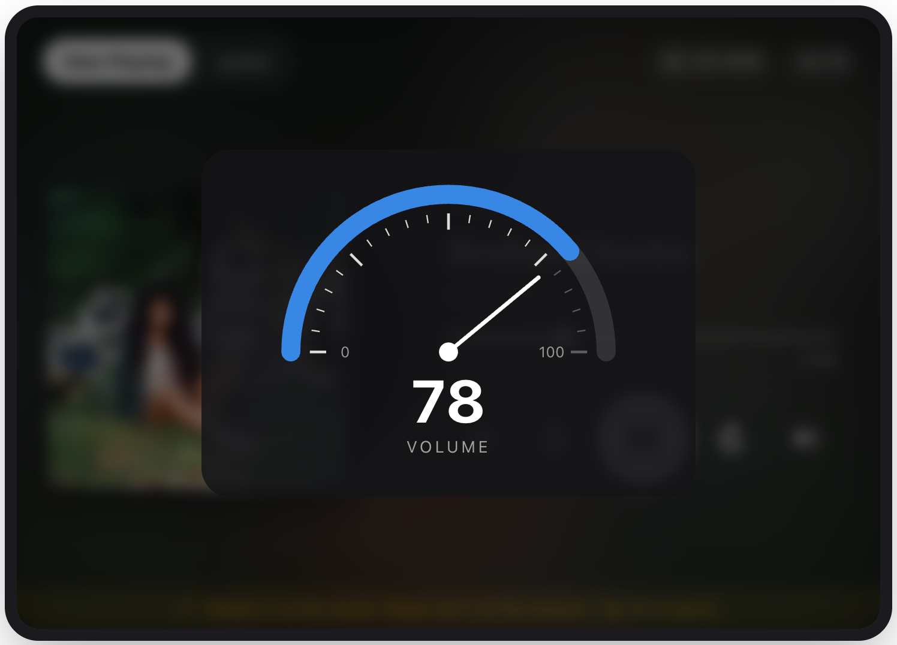 | 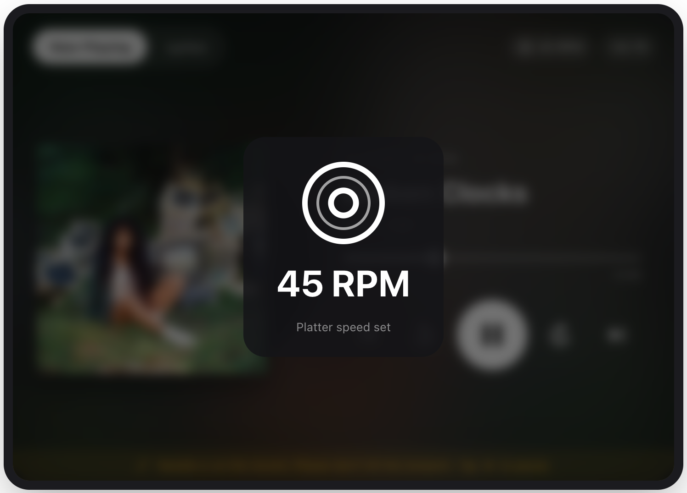 |

**Speed lock (from interview feedback).** P3 pointed out that you can switch a record to the wrong speed, so the player now guards against it:

- **Locked while playing.** While the needle is on the record, the mode knob locks. The speed chip shows a lock, and the testing panel shows the other positions locked. Turning the knob anyway brings up "Speed locked" with a Pause button, because pausing is what unlocks it.
- **Speed from disc size.** A sensor on the platter tells a 12″ LP (33⅓ RPM) from a 7″ single (45 RPM). Now Playing shows the size, for example "12″ LP", and the "Detected" screen says which speed the record plays at.
- **Wrong speed blocked.** If the record is paused and the knob is turned to a speed that doesn't match the disc, the speed chip turns amber and reads "Set speed to 33⅓ RPM". Pressing Play won't drop the needle. Instead, the display explains that this is a 12″ LP and which way to turn the knob. The same check runs after a new record is put on.

| Locked while playing | Wrong speed for this disc | What the speed chip shows |
| --- | --- | --- |
| 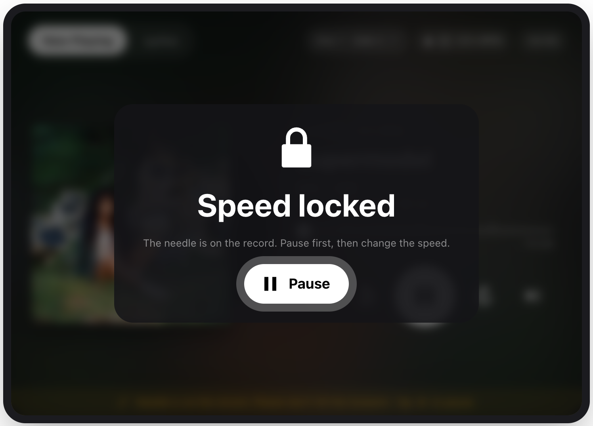 | 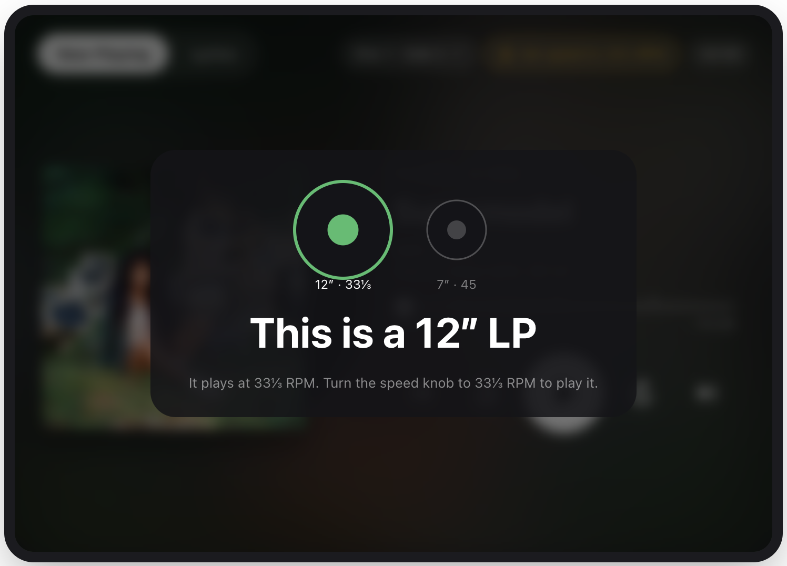 | 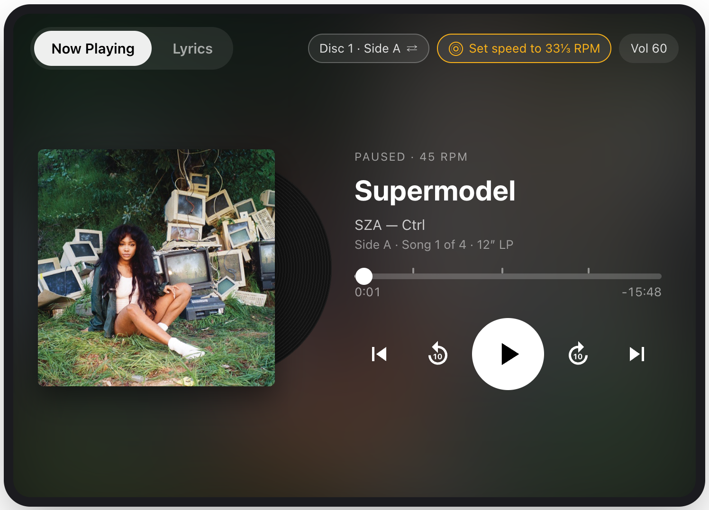 |

### Companion app

A mini player at the top controls the same player as the touchscreen, with previous, play/pause and next. The header shows the connection and the current knob settings.

**Now Playing sheet.** Tapping the mini player's artwork or title slides up a full Now Playing view. It shows large artwork, the song, artist and album, the side and song number, the disc size and speed, and a scrubber for the current song. It also has previous, play/pause and next, the same volume controls, and what's up next. On the last song of a side, "up next" becomes a reminder to flip the record or swap discs, which answers P2's wish to see the next song while one is playing. The chevron at the top, or Escape, closes it.

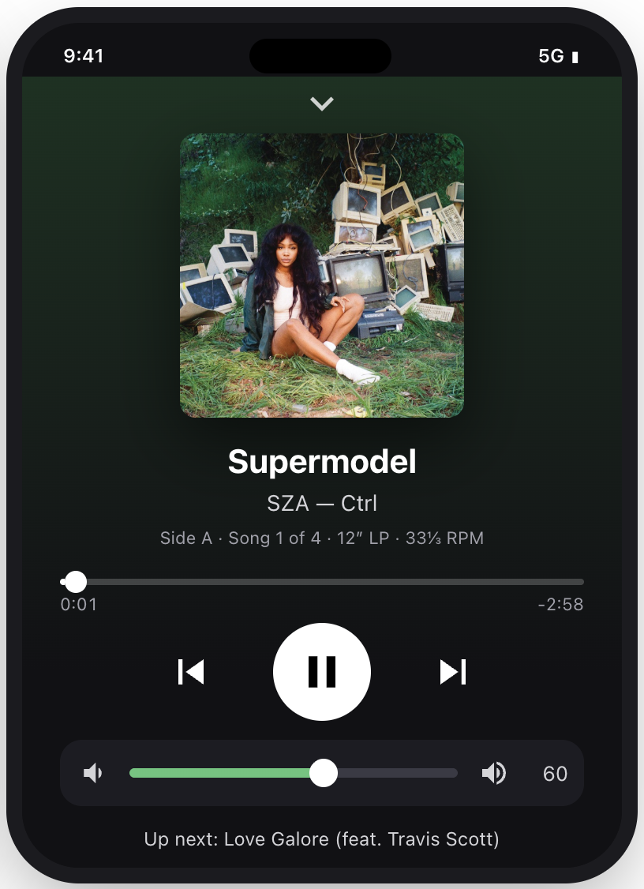

**Scrubbing from the phone.** Dragging the song scrubber in the sheet works like the one on the display: it moves the real tonearm. When you press, the needle lifts; as you drag, the arm follows; when you let go, it drops at that point in the song. The phone shows "Moving the needle…" while the player's screen shows the arm swinging to the new groove. In Bluetooth mode the scrubber seeks instantly.

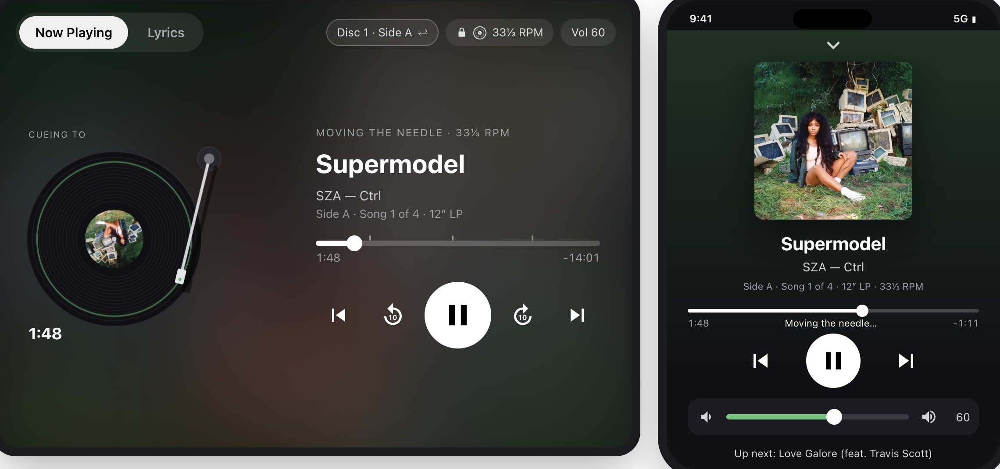

**End of a side, on the phone.** When the needle reaches the end of a side, the phone shows the same choices as the player's screen. The heading says what to do ("Side A is over. Flip the record to Side B"), every side is listed as Flip, Swap disc or Play again with the next one highlighted, and other albums are offered. Choosing on the phone does exactly what choosing on the player does. Both screens walk through the step (the disc flipping over, or one disc going back in its sleeve and the next coming in), both show "✓ Detected", and the needle drops. "Not now" closes the choices on both screens. The phone then keeps a tappable "Side A is over" notice, and the side chip on the Now Playing sheet opens the same choices at any time.

| Side over on the phone | New album detected on both |
| --- | --- |
| 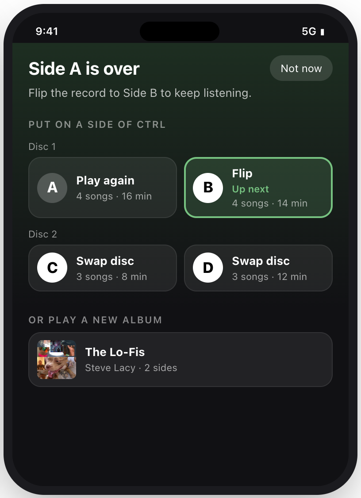 | 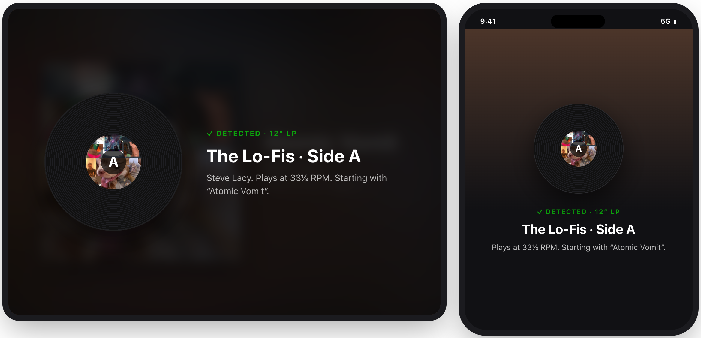 |

**Remote volume.** Below the mini player, a volume row with down/up buttons and a slider sets the speaker volume from anywhere in the room. It's the same volume as the physical knob. The knob is an endless rotary encoder with an LED ring, so it never disagrees with a change made from the phone. The player's screen shows the arched volume meter labelled "Set from the companion app", so people near the player know why the sound changed.

| Volume row in the app | What the player shows |
| --- | --- |
| 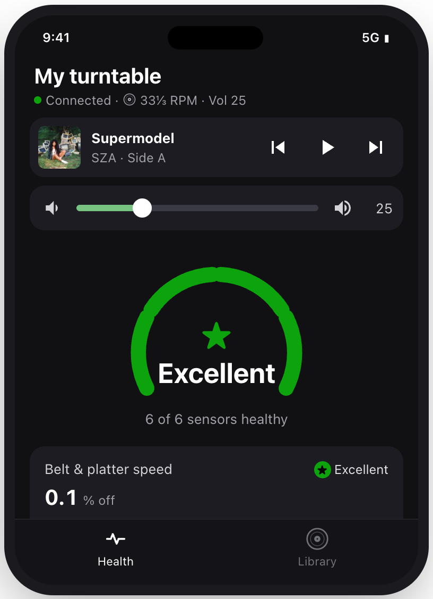 | 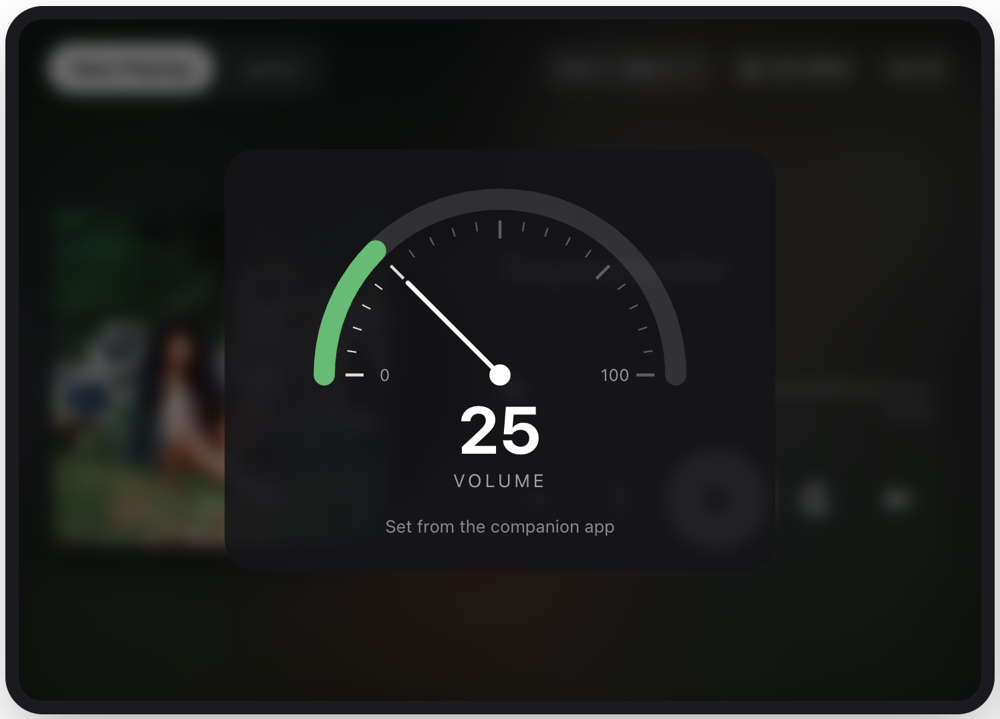 |

**Health.** One headline rating out of four tiers (**Excellent / Good / Fair / Poor**), computed from six sensors. Each sensor card shows its reading, its own tier and a four-segment bar. Anything Fair or Poor also shows how to fix it. The overall rating is the average of the sensors, but a single Poor sensor caps it at Fair so a serious problem can't hide behind good readings. Every tier pairs its color with a symbol and a label, so the rating doesn't depend on color alone.

| Excellent (Audiophile collector) | Poor (Inherited player) | Sensor cards |
| --- | --- | --- |
| 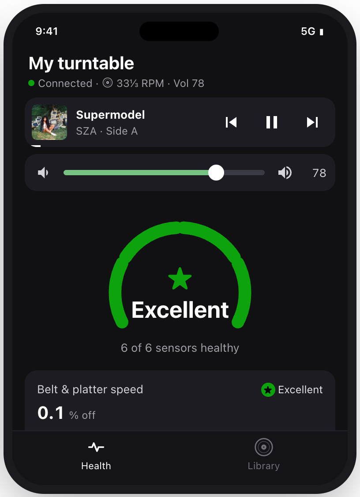 | 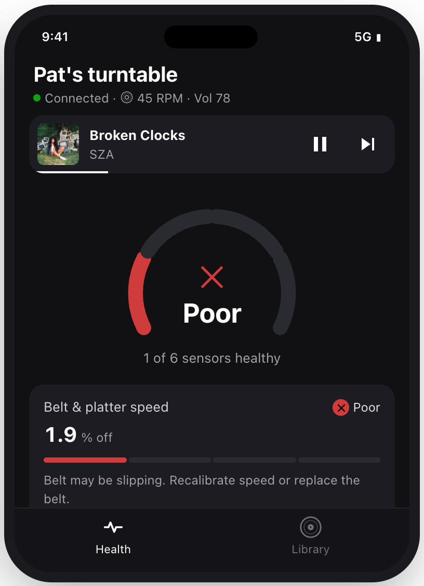 | 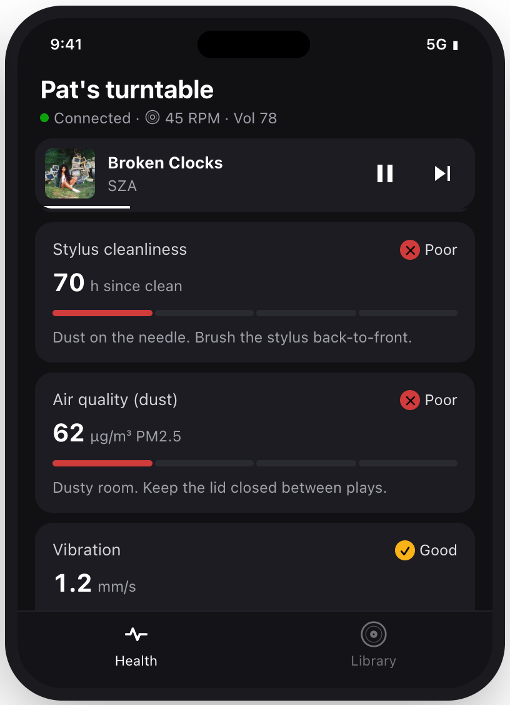 |

**Library.** The collection shows each record as a disc in its actual vinyl color, with special and limited editions starred and a filter to show only those. Insights shows hours listened, songs spun, the day streak, songs the player detected this session, a day-by-hour heatmap (hover a cell for the count) and top artists.

| Collection | Insights | Heatmap & top artists |
| --- | --- | --- |
| 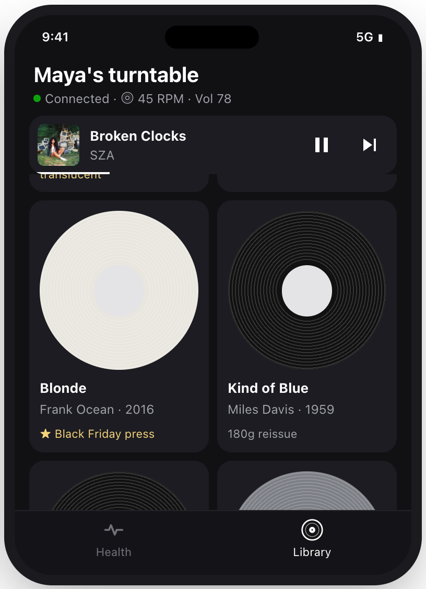 | 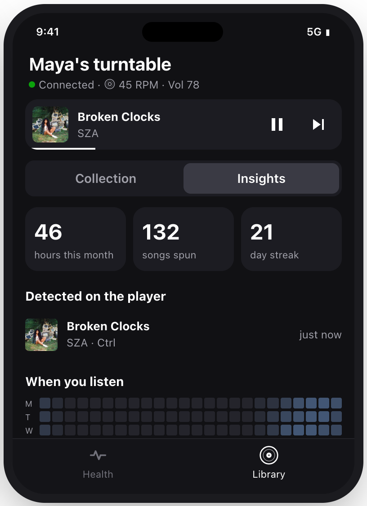 | 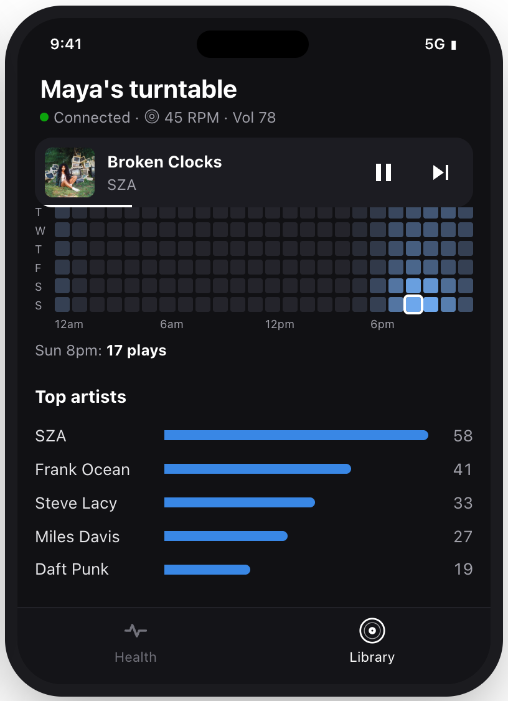 |

### Why a companion app (Option 2)

The touchscreen is for the moment of listening: it is big, glanceable and right next to the record. Health and history are different jobs. You check them occasionally, often when you're not near the player, and they need more room than a playback screen should give up. The phone handles those, and also works as a remote.

The two stay connected in both directions. The phone's play/pause, previous/next, song scrubber, volume controls and side/record choices drive the player. The player's current song, playing state, knob settings and detected plays all show up on the phone. The **Side by side** view makes this visible.

### Why the sensor data matters (Option 3)

Most turntable problems are invisible until they audibly damage the sound or the records: a slipping belt, a dirty stylus, a tilted tonearm. The health screen turns them into one rating with specific fixes, so owners can act before it gets that far. The four owner profiles show the range:

| Profile | Situation | Health |
| --- | --- | --- |
| Audiophile collector | Dedicated listening room | Excellent |
| First turntable | Weekend afternoon listener | Good |
| College dorm | The player shares a desk with a subwoofer | Fair: dusty air, high vibration, dirty stylus |
| Inherited player | Set up in a garage workshop | Poor: slipping belt, worn stylus, tilted arm, clipping |

The library and listening stats come from the same sensing. Because the player recognizes what is playing, collectors get stats.fm-style insights for physical records without logging anything.

---

## Implementation

- **Svelte 5 + JavaScript, built with Vite.** Components use Svelte 5's runes (`$state`, `$derived`, `$effect`).
- **One shared player state.** `player.svelte.js` holds a single audio element and one reactive state object: the record, side and song on the platter, playing, time, volume, mode, the tonearm, the side-change prompt, the owner profile and detected plays. The touchscreen, the phone and the testing panel all read and change this one object, which is what keeps the two devices in sync. For example, scrubbing on the phone moves the same tonearm the display draws.
- **Tonearm cueing.** Every seek in 33⅓/45 mode runs a small sequence: lift, move, lower. The audio pauses during the move, but the player remembers whether the user wants music, so the play/pause button never flickers. A counter cancels a move that's still running when a new seek arrives, which keeps rapid ±10 taps and scrubbing smooth.
- **Speed lock.** Each record stores its disc size. The player refuses speed changes while the needle is down, and refuses to drop the needle at a speed that doesn't match the disc.
- **One picker, two screens.** The end-of-side wording (`sideChange.js`) and the record graphic with its flip and swap animations (`Disc.svelte`) are shared by the display and the phone, so the two screens always say and show the same thing.
- **Physical inputs as events.** A knob turn or a hand near the tonearm sets a fresh event object in that state. The display watches for it and shows a timed overlay.
- **Records and sides.** Each album is a single audio file. Its side and song timestamps, entered from the album's track list, are expanded into sides with start and end times and a disc number. Playback, scrubbing and the tonearm all work within the current side. When a side ends, a short sequence handles the change: you place the new side, the player detects it, and the needle drops.
- **Lyrics.** Fetched at runtime from LRCLIB's free API, matched to each song by title and length, and parsed from LRC format (`[mm:ss.xx] line`). The times are offset by where the song starts in the album file. LRC only times whole lines, so highlighting is line by line. A per-song offset can re-sync lyrics if they drift from the audio.
- **Data.** The four owner profiles, sensor thresholds and tier rule live in `scenarios.js`. Each heatmap is generated from that owner's peak listening hours.
- **Accent color from the artwork.** Each record stores its cover's dominant color, measured from the artwork: green for *Ctrl*, warm clay for *The Lo-Fis*. Buttons, highlights and the display's glow all take their color from it. The hue follows the artwork, but lightness is fixed separately for light and dark mode (CSS `oklch(from …)`), so button text stays readable (at least 4.5:1 contrast). When a new record goes on, the whole page fades to its color.
- **Charts.** All hand-built with SVG and CSS, with no chart library: the volume meter, the health arc, the sensor bars, the heatmap and the top-artist bars. The health tiers use a fixed status palette, always paired with a symbol and a label.
- **Checks and hosting.** A small Node test (`npm test`) covers lyric parsing, the health-tier logic, how sides and discs are built from the track list, and disc size to speed. Every feature was also checked by driving the app in a real browser. A GitHub Actions workflow tests, builds and deploys the app to GitHub Pages on every push.

---

## Future work

- **Letter-by-letter lyrics.** The original design highlighted lyrics down to each letter. That needs word- or syllable-level timing, which LRCLIB doesn't provide.
- **Real speed effects.** The mode knob changes the display and the platter animation but not the audio. A real 45 RPM setting would audibly speed up a 33⅓ record.
- **Health over time.** Readings are a snapshot per owner profile. A history view could show the stylus wearing and dust building up week by week, with reminders.
- **Phone → display sharing.** In Bluetooth mode, the phone could send its own album art and lyrics to the player's screen.
- **Offline fallback.** Lyrics and album art load from the internet. Caching them would keep the display working without a connection.
- **A 7″ single to demo 45 RPM.** Both sample records are 12″ LPs, so the 45 RPM path (a 7″ single detected and played at 45) is only covered by the unit test.

From the interviews:

- **Health alerts on the player too (P1).** Show a short alert on the display as well as in the app, for people who don't want another app.
- **Monthly and skip stats (P1, P3).** Most-played records each month, and which songs get skipped.
- **Share stats with friends (P2).** A shareable stats card, similar to Spotify Wrapped.
- **Decibel readout (P1).** A small live level meter below the Now Playing controls.
- **Inner artwork (P1).** Scan a record's inner sleeve and show its artwork on the display.

---

## AI usage

I used Claude Code, an AI coding assistant, to implement my designs in Svelte and to draft parts of this write-up, while the design decisions, interviews and final choices were my own. I followed a spec-driven approach. Before any code, I wrote a detailed spec of both interfaces: the pages, the signifiers, the knob behavior, the sensors and the 1.41 ratio. That spec, together with the assignment's requirements, lives in the project's [`CLAUDE.md`](https://github.com/sai-porumamilla/UI-Project_1/blob/main/CLAUDE.md), which the AI reads before every change. Each new feature started as an addition to the spec, often driven by the interview findings in the needs and requirements table, like P3's wrong-speed comment becoming the speed lock. Then it was built to match, and the spec was updated so it always described the current design. I tested what it built against the spec and asked for changes until it worked the way I intended.

It sped up the technical work a lot, but I still had to review everything closely, since it occasionally made mistakes I had to catch. For example, the Play button once stopped working because the AI's testing had shut down my local server, which I noticed and had it fix. I learned that being specific about the behavior I wanted got much better results, and that I still needed to understand the code to judge whether it was right.

In detail, here is what Claude Code did in this project:

- **Code:** both device interfaces, the master page and the testing panel, built from my design spec, plus each feature I asked for after that:
  - tonearm cueing for scrubbing
  - album sides with flip and swap prompts on both screens
  - the speed lock with disc-size detection
  - accent colors taken from the artwork
  - the phone's previous button, Now Playing sheet, scrubber and remote volume
- **Data and assets:**
  - the four mock owner profiles
  - finding the LRCLIB lyrics source and matching all 29 songs
  - re-encoding the album audio to fit GitHub's file limits
- **Checking:** a small automated test, and driving each feature in a real browser to catch bugs
- **Setup:** the project's `CLAUDE.md` guidance file and the GitHub Pages deployment
- **Docs:** tidying my interview notes into anonymized, lint-clean Markdown, the screenshots on this page, and a first draft of this write-up from my notes and the code

The design decisions were mine:

- the 1.41 ratio and the two-screen setup
- the display pages, the tonearm warning and the knob behavior
- the six sensors and four health tiers, and the library and insights
- flipping and swapping records, and scrubbing that moves the needle
- the changes that came from my interviews

---

## Demo video

> **TODO (Sai):** Embed or link a 2–3 minute demo with voiceover covering the project name, your name, the components and how it works.
